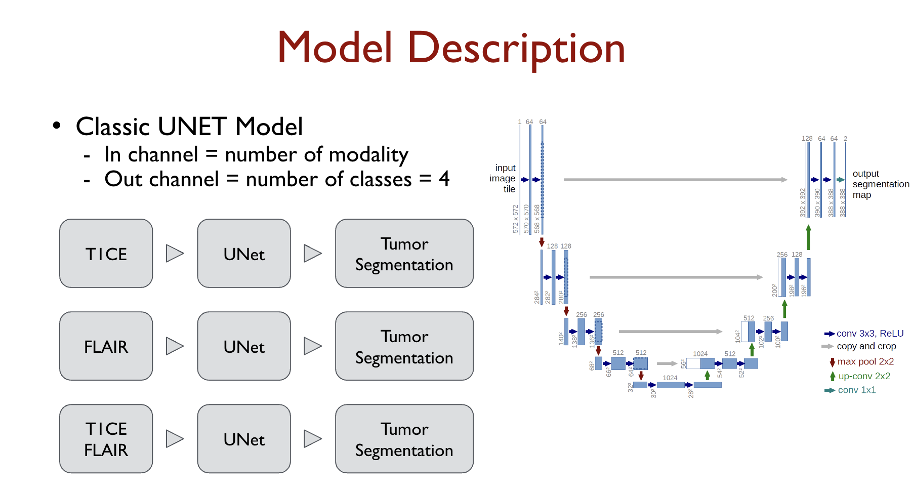

# smart_brains


## Multimodal U-Net for Tumor segmentation

We implemented U-Net for the BraTS challenge using data downloaded from https://www.kaggle.com/datasets/kanisfatemashanta/brats2021-training-and-validation. Since the validation folder in this dataset does not include ground truth label data, we randomly selected 10 images from the training folder for testing purposes. We then applied an 8:2 ratio split for training and validation.

## Model structure




## U-Net Model Training Script
This script is designed for training the U-Net model on medical imaging data, particularly for tasks like segmentation of brain tumors. It leverages PyTorch for deep learning functionalities and supports various data augmentations and loss functions to optimize model performance.

### Features

- Training U-Net with customizable epochs, learning rates, and batch sizes.
- Support for multiple loss functions and optimizers.
- Option to load a pre-trained model or start training from scratch.
- Data augmentation capabilities for enhanced model robustness.
- Integration with albumentations for image transformations.

### Prerequisites
Before running the script, ensure all libraries in the **'requiremetns.txt'** are installed:
```command
pip install -r requirements.txt
```

### Setup: specify your working directory
1. Clone this repository or download the script to your local machine.
2. Set the environment variable MODEL_PATH to specify the default path to your models. If not set, the script uses ./default_model_path as the fallback directory.
```command
export MODEL_PATH=./default_model_path
```

### Usage

Run the script from the command line by providing the necessary arguments. Below are the supported command-line arguments along with examples on how to use them.

#### Command-Line Arguments

- `--num_epochs`: Number of epochs to train the model (default: 20).
- `--learn_rate`: Learning rate for the optimizer (default: 1e-4).
- `--batch_size`: Batch size for training (default: 16).
- `--loss_type`: Specifies the loss function to use; options include 'CrossEntropy', 'Dice', 'MultiDice' (default: 'MultiDice').
- `--modal_type`: Type of imaging modality to use (default: 'T1CE').
- `--exp_name`: Name for the experiment (default: 'MyExperiment').
- `--optimizer_name`: Name of the optimizer to use (default: 'Adam').
- `--load_model_name`: Specifies the model name to load if resuming from a previous state.
- `--load_last_model`: Flag to load the last saved model; use this to resume training.
- `--with_transform`: Enable or disable data transformations during training (default: False).
### Examples

**Train a new model**
```bash
python parse_train.py --num_epochs 2 --learn_rate 1e-4 --modal_type t1ce,flair --exp_name "temp"
```
**Training with transformations**
```bash
python parse_train.py --num_epochs 2 --learn_rate 1e-4 --modal_type [t1ce,flair] --with_transform true --exp_name "MyExperiment"
```


## Model analysis
This step will generate metrics--accuracy, precision, recall, specificity, F1, and Dice--to summarize models' performance and save outputs in a csv file.
### Usage
```command
python scripts/metrics.py --model_folder <path_to_models_directory> [--load_model_names <model1 model2 ...>]
```
#### Arguments
Run the script from the command line, providing either one of following argument:
- **`--model_folder`** : Specifies the path to the folder containing all models. Metrics will be computed for all models in this directory unless specific models are named using the `--load_model_names` option.
- **`--load_model_names`** : A space-separated list of specific model names to load. This parameter allows you to target specific models within the specified directory for processing.

### Examples
**1. Using the default settings:**
```bash
python scripts/metrics.py--model_folder path/to/model/RESULTS
```
This command runs the script using all models in the specified folder without specifying any particular models to load.

**2. Specifying models to load:**
```command
python scripts/metrics.py --load_model_names "myModel1" "myModel2" "myModel3"
```


